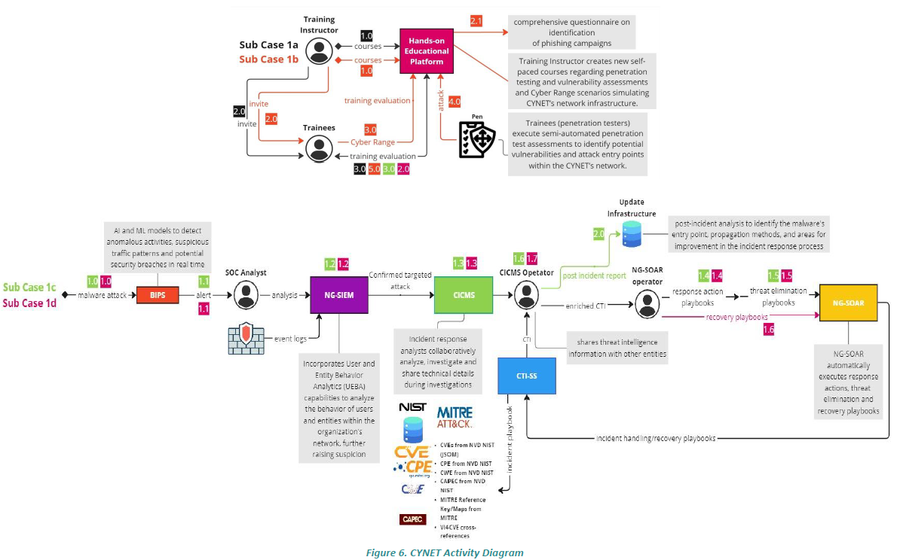

# lm5-1b — PUC2-Sub Case 2b: Network Vulnerability Identification Training

This repository contains all the materials required to run the practical exercises of
**PUC2-Sub Case 2b** on the **CyberRangeCZ** platform. The scenario trains staff in
penetration testing and vulnerability assessments via a hands-on educational platform
that simulates CYNET's network infrastructure.

## Scenario overview

Staff members undergo extensive training in penetration testing and vulnerability
assessments via a hands-on educational platform. The Training Instructor develops
self-paced courses and Cyber Range scenarios that simulate CYNET's network infrastructure.
Trainees engage in practical exercises where they:

- Gather technical information about the network (domain names, IP addresses, services)
- Conduct semi-automated vulnerability assessments using Nmap and NSE scripts
- Identify vulnerabilities, misconfigurations, and potential entry points
- Compile detailed reports with CVE/CVSS ratings and remediation recommendations

The Cyber Range platform provides evaluation feedback, enabling trainees to review
their performance and refine their skills.

## Training flow (3 phases, 11 steps)

| Phase | Steps | Description |
|-------|-------|-------------|
| **Training & invitation** | 1–3 | Instructor creates cyber range scenario + courses; invites trainees; trainees access material |
| **Recon & scanning** | 4–7 | Trainee gathers info + runs scans; target responds; tools return findings; consolidated results |
| **Reporting & recommendations** | 8–11 | Trainee submits report to Gitea; instructor evaluates; feedback delivered to trainee and instructor |

The complete step-by-step definition is in `training_linear.json`.

## Key files

| File / directory | Purpose |
|-----------------|---------|
| `topology.yml` | CyberRangeCZ sandbox topology (hosts, networks, router mappings) |
| `training_linear.json` | Learning sequence — 3 phases, 11 steps, actors, tools, success criteria |
| `provisioning/playbook.yml` | Main Ansible playbook orchestrating all roles |
| `provisioning/roles/` | Ansible roles for each platform component |
| `provisioning/case-2b/` | Scenario-specific topology and helper scripts |
| `docs/subcase-2b-network-vuln-training.md` | Detailed deployment and operational guide |
| `group_vars/trainees.yml` | Shared variables for pentest workstations |
| `inventory.sample` | Inventory template — load secrets via Ansible Vault or environment variables |

## Infrastructure summary

| Component | Host | IP | Network | Technology |
|-----------|------|----|---------|-----------|
| LMS course portal | rep-practical-labs | 10.20.10.40 | rep-backend | Nginx (port 8080) |
| Instructor console | instructor-console | 10.20.20.10 | rep-frontend | Ubuntu + tmux |
| Pentest workstations | pentest-workstation-01/02 | 10.20.20.50–60 | rep-frontend | Ubuntu + Nmap |
| Reporting dashboard | reporting-workspace | 10.20.30.10 | analytics-zone | Grafana + PostgreSQL |
| Report repository | report-repository | 10.20.30.20 | analytics-zone | Gitea (Docker) |
| Target network | target-server | 10.20.40.10 | target-zone | DVWA + weak SSH (Docker) |

All networks are interconnected via `rep-gateway` (Debian 12 router).
The `target-zone` (10.20.40.0/24) is accessible from the frontend network but isolated from backends.

See `docs/subcase-2b-network-vuln-training.md` for the full architecture description and
first-run checklist.



## Deploying

```bash
# 1. Copy and fill the inventory
cp inventory.sample inventory.ini
# Edit inventory.ini with real host addresses and credentials

# 2. Run the provisioning playbook
provisioning/run_playbook.sh inventory.ini
```

### Environment variables required

```bash
export ANSIBLE_PASSWORD_REP_SCHEDULER=...
export ANSIBLE_PASSWORD_REP_LIVE=...
export ANSIBLE_PASSWORD_REP_QUIZ=...
export ANSIBLE_PASSWORD_REP_LABS=...
export ANSIBLE_PASSWORD_INSTRUCTOR=...
export ANSIBLE_PASSWORD_PENTEST1=...
export ANSIBLE_PASSWORD_PENTEST2=...
export ANSIBLE_PASSWORD_TARGET=...
export ANSIBLE_PASSWORD_REPORTING=...
export ANSIBLE_PASSWORD_REPORT_REPO=...
```

## Exporting results

```bash
GITEA_TOKEN=<instructor-token> provisioning/case-2b/scripts/export_scan_results.sh
```

## Validating the repository

```bash
pip install -r requirements-dev.txt
pytest
```

The tests verify that `training_linear.json` is structurally valid and sequential,
and that the topology files only reference defined hosts, networks, and routers.

## Credential management

Replace password placeholders in `inventory.sample` using Ansible Vault files or
exported environment variables. Never commit real credentials to the repository.

## Licence

The content is provided strictly for educational purposes.
