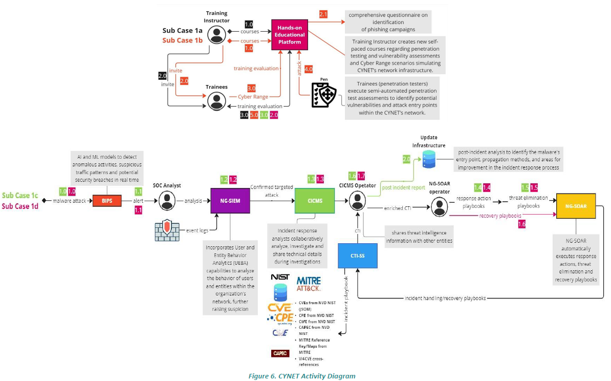

# lm5-1b — PUC2-Sub Case 2b: Network Vulnerability Identification Training

This repository contains all the materials required to run the practical exercises of
**PUC2-Sub Case 2b** on the **CyberRangeCZ** platform. The scenario trains staff in
penetration testing and vulnerability assessments via a hands-on educational platform
that simulates CYNET's network infrastructure.

## Scenario overview

Staff members undergo extensive training in penetration testing and vulnerability
assessments via a hands-on educational platform. The Training Instructor develops
self-paced courses and Cyber Range scenarios that simulate CYNET's network infrastructure.
Trainees engage in practical exercises where they:

- Gather technical information about the network (domain names, IP addresses, services)
- Conduct semi-automated vulnerability assessments using Nmap and NSE scripts
- Identify vulnerabilities, misconfigurations, and potential entry points
- Compile detailed reports with CVE/CVSS ratings and remediation recommendations

The Cyber Range platform provides evaluation feedback, enabling trainees to review
their performance and refine their skills.

## Training flow (3 phases, 11 steps)

| Phase | Steps | Description |
|-------|-------|-------------|
| **Training & invitation** | 1–3 | Instructor creates cyber range scenario + courses; invites trainees; trainees access material |
| **Recon & scanning** | 4–7 | Trainee gathers info + runs scans; target responds; tools return findings; consolidated results |
| **Reporting & recommendations** | 8–11 | Trainee submits report to Gitea; instructor evaluates; feedback delivered to trainee and instructor |

The complete step-by-step definition is in `training_linear.json`.

## Key files

| File / directory | Purpose |
|-----------------|---------|
| `topology.yml` | CyberRangeCZ sandbox topology (hosts, networks, router mappings) |
| `training_linear.json` | Learning sequence — 3 phases, 11 steps, actors, tools, success criteria |
| `provisioning/playbook.yml` | Main Ansible playbook orchestrating all roles |
| `provisioning/roles/` | Ansible roles for each platform component |
| `provisioning/roles/man/` | syslog-ng forwarding configuration applied to the sandbox MAN node |
| `provisioning/collections.yml` | Ansible collections required by the playbook |
| `provisioning/requirements.yml` | External Galaxy roles required by the playbook (`sandbox-logging`) |
| `provisioning/case-2b/` | Scenario-specific topology and helper scripts |
| `provisioning/scripts/` | CACAO playbook lifecycle helpers (NG-SOC / NG-SOAR / CI-CMS APIs) + bats tests |
| `docs/subcase-2b-network-vuln-training.md` | Detailed deployment and operational guide |
| `docs/provisioning-guide.md` | Step-by-step KYPO/CRCZ topology import and Ansible run |
| `group_vars/trainees.yml` | Shared variables for pentest workstations |
| `inventory.sample` | Inventory template — load secrets via Ansible Vault or environment variables |
| `tests/test_validation.py` | Offline validation of the training definition and topology files |
| `tests/smoke_test.yml` | Post-deployment smoke test of the trainee-facing hands-on steps |

## Infrastructure summary

| Component | Host | IP | Network | Technology |
|-----------|------|----|---------|-----------|
| LMS course portal | rep-practical-labs | 10.20.10.40 | rep-backend | Nginx (port 8080) |
| Instructor console | instructor-console | 10.20.20.10 | rep-frontend | Ubuntu + tmux |
| Pentest workstations | pentest-workstation-01/02 | 10.20.20.50–60 | rep-frontend | Ubuntu (console only) + Nmap/ZAP/curl/sqlmap |
| Reporting dashboard | reporting-workspace | 10.20.30.10 | analytics-zone | Grafana + PostgreSQL |
| Report repository | report-repository | 10.20.30.20 | analytics-zone | Gitea (Docker) |
| Target network | target-server | 10.20.40.10 | target-zone | DVWA + weak SSH (Docker) |
| CYNET identity & access | cynet-dc1 | 10.20.40.20 | target-zone | OpenLDAP + phpLDAPadmin (Docker) |

All networks are interconnected via `rep-gateway` (Debian 12 router).
The `target-zone` (10.20.40.0/24) is accessible from the frontend network but isolated from backends.

See `docs/subcase-2b-network-vuln-training.md` for the full architecture description and
first-run checklist.

> **Pentest tooling note.** The pentest workstations are console-only hosts
> (accessed via the browser terminal / SSH, with a headless JRE and no graphical
> desktop). Nmap, curl, sqlmap and the headless OWASP ZAP scan
> (`/opt/pentest/scripts/zap-scan.sh`, run in Docker) are fully usable there.
> **Burp Suite Community is GUI-only and therefore not runnable on these hosts** —
> `burp-launcher.sh` exits early when no X display is present. The Burp jar and
> launcher are still provisioned for environments that add a graphical desktop
> (X11 / VNC / Guacamole) or use X11 forwarding; in the default console-only lab,
> manual web testing is done with curl + sqlmap and Burp's Repeater workflow is
> taught as a concept.



## Deploying

```bash
# 1. Copy and fill the inventory
#    (inventory.ini is committed as a placeholder — overwrite it with your own copy)
cp inventory.sample inventory.ini
# Edit inventory.ini with real host addresses and credentials

# 2. Run the provisioning playbook
provisioning/run_playbook.sh inventory.ini
```

`run_playbook.sh` installs the collections listed in `provisioning/collections.yml`
and the external Galaxy roles listed in `provisioning/requirements.yml` before
running the playbook, so use it rather than calling `ansible-playbook` directly.

### Environment variables required

```bash
export ANSIBLE_PASSWORD_REP_SCHEDULER=...
export ANSIBLE_PASSWORD_REP_LIVE=...
export ANSIBLE_PASSWORD_REP_QUIZ=...
export ANSIBLE_PASSWORD_REP_LABS=...
export ANSIBLE_PASSWORD_INSTRUCTOR=...
export ANSIBLE_PASSWORD_PENTEST1=...
export ANSIBLE_PASSWORD_PENTEST2=...
export ANSIBLE_PASSWORD_TARGET=...
export ANSIBLE_PASSWORD_CYNET_DC1=...
export ANSIBLE_PASSWORD_REPORTING=...
export ANSIBLE_PASSWORD_REPORT_REPO=...
```

## Sandbox logging

The last two plays of `provisioning/playbook.yml` wire the sandbox into the
CyberRangeCZ logging pipeline. They run against the groups the platform generates
in its own inventory (`man`, `routers`, `hosts`), not against the hosts declared in
`inventory.sample`:

| Play | Target | What it does |
|------|--------|--------------|
| `Configure syslog-ng forwarding on the MAN node` | `man` | Deploys `/etc/syslog-ng/conf.d/forward-rfc5424-messages.conf` (RFC 5424 relay listening on TCP 514, forwarding to `10.250.232.186:515`) and restarts syslog-ng |
| `Set up command logging` | `routers`, `hosts` | Applies the external `sandbox-logging` role to every Linux node, sending events to port 514 when a MAN node exists and directly to 515 otherwise |

Outside CyberRangeCZ these groups are usually empty, so both plays are simply skipped.

## Exporting results

```bash
GITEA_TOKEN=<instructor-token> provisioning/case-2b/scripts/export_scan_results.sh
```

## Validating the repository

```bash
pip install -r requirements-dev.txt
pytest
```

The tests verify that `training_linear.json` is structurally valid and sequential,
and that the topology files only reference defined hosts, networks, and routers.
They also check that key role defaults (pentest tools, target network, report
repository, reporting workspace) still expose the variables the scenario relies on.

## Validating a deployment

After provisioning, run the non-destructive smoke test against the same inventory to
confirm the trainee-facing hands-on steps actually work:

```bash
provisioning/run_playbook.sh inventory.ini tests/smoke_test.yml
```

It checks cross-zone routing from the pentest workstation (to DVWA and Gitea),
DVWA login and SQL injection, weak-credential SSH, and a Gitea push.
See `provisioning/README.md` for the details.

## Credential management

Replace password placeholders in `inventory.sample` using Ansible Vault files or
exported environment variables. Never commit real credentials to the repository.

## Licence

The content is provided strictly for educational purposes.
